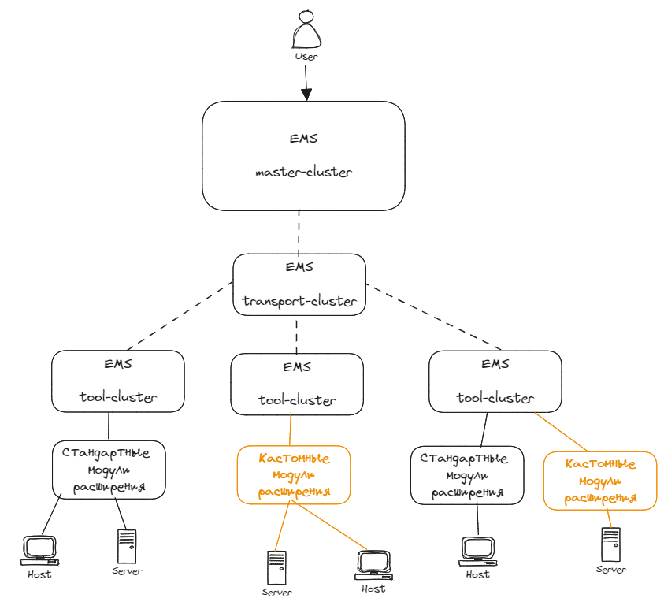

# EMS SDK

> В разработке

## Описание решения

EMS - это система управления, инвентаризации и мониторинга ИТ-инфраструктуры корпоративного класса с возможностью расширения и адаптации функциональных возможностей под потребности конечного пользователя.  
Относится к классу систем управления и контроля групп однотипных сетевых или вычислительных элементов.

Предназначена для решения следующих задач:

- Автоматизация задач управления серверным оборудованием;
- Автоматизация задач управления сетевым оборудованием;
- Мониторинг доступности серверов, устройств хранения и сетевых коммутаторов;
- Мониторинг виртуальных машин, гипервизоров, систем и сервисов;
- Мониторинг компонентов серверов;
- Автоматизация развёртывания операционных систем и программного обеспечения;
- Предоставление информации для планирования модернизации оборудования ИТ-инфраструктуры;
- Администрирование географически распределенной ИТ-инфраструктуры;

Является системой управления и мониторинга для работы в мульти-вендорных окружениях. С помощью открытых протоколов, система EMS может взаимодействовать с широким спектром оборудования, позволяя администраторам собирать и отображать инвентарную информацию, информацию по здоровью и загруженности объектов ИТ-инфраструктуры. Возможность расширения функциональных возможностей системы в рамках поддерживаемого перечня метрик и операций управления конечным пользователем, средствами SDK. Помимо сбора и отображения информации об оборудовании, система EMS позволяет производить операции управления над серверами, включая управление питанием, настройками а позволяя администраторам устанавливать ОС и прикладное ПО, работая одновременно с любым числом оборудования. Гранулярное управления правами и доступом к оборудованию, детальное журналирование действий администраторов, функция двойного подтверждения операций над серверами а также возможность использования технологии единого входа на серверы, делает управление серверами при помощи EMS безопасным и защищённым от несанкционированного использования.

Поставляемый SDK включает в себя набор инструментов, посредством которых разработчик может адаптировать EMS под текущие потребности и расширять перечень производителей оборудования для обеспечения поддержки полного фукнционала системы самостоятельно добавляя необходимые драйверы, скрипты и настройки. Таким образом, вы сможете подключать к EMS SDK любое оборудование, которое поддерживает стандартные протоколы, такие как Redfish, SNMP, IPMI, SSH и т.д. К инструментам для разработки програмного относятся:

- Примеры кода (С#, Golang);
- Документация;

## Модули расширения системы и использование SDK

Благодаря SDK разработчик получает возможность написания собственных модулей расширения для EMS.

Это позволяет обеспечить совместимость системы с любыми объектами мониторинга и управления инфраструктуры, в рамках поддерживаемых операций управления и метрик.

Концептуальная схема взаимодействия:

Описание доступных для кастомизации функциональных возможностей, а также руководства по созданию кастомных модулей расширения доступны по ссылкам:

- Модуль расширения для работы с BMC оборудования - [BMC manager](extend_bmc);
- Модуль расширения для работы с гипервизорами оборудования - [Hypervisor manager](extend_hypervisor);
- Модуль расширения для работы с оборудованием, использующем операционную систему семейства Linux - [Linux manager](extend_linux);
- Модуль расширения для работы с сетями и коммутаторами - [Network/switch manager](extend_network_switch);
- Модуль расширения для работы с установкой операционных систем - [OS installer](extend_os_install);
- Модуль расширения для работы с SNMP мониторингом оборудования и сбором логов - [SNMP/Syslog manager](extend_snmp);
- Модуль расширения для работы с технологией единого входа в веб-интерфейс BMC оборудования - [SSO center](extend_sso_bmc);
- Модуль расширения для работы с веб-сервисами оборудования - [Web-service manager](extend_web_service);
- Модуль расширения для работы с оборудованием, использующем операционную систему Windows - [Windows manager](extend_windows);
