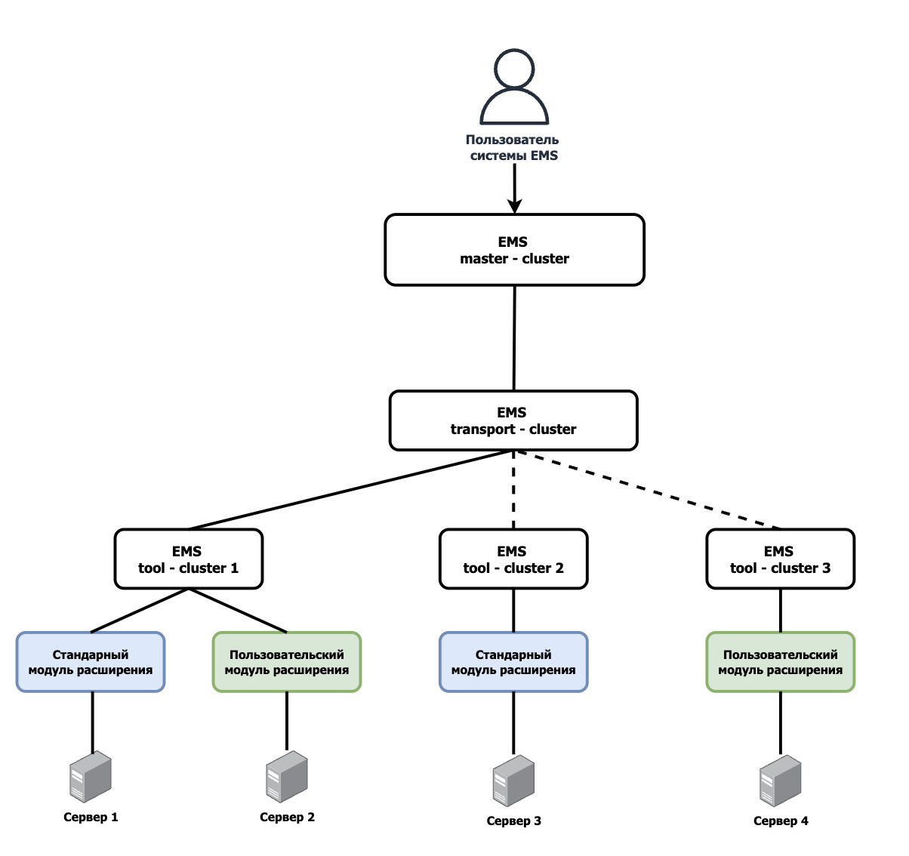

# EMS SDK

> В разработке
> 
## Описание решения

EMS - это система управления, инвентаризации и мониторинга ИТ-инфраструктуры корпоративного класса.

Предназначена для решения следующих задач:

- Автоматизация задач управления серверным оборудованием;
- Автоматизация задач управления сетевым оборудованием;
- Мониторинг доступности серверов, устройств хранения и сетевых коммутаторов;
- Мониторинг виртуальных машин, гипервизоров, систем и сервисов;
- Мониторинг компонентов серверов;
- Автоматизация развёртывания операционных систем и программного обеспечения;
- Предоставление информации для планирования модернизации оборудования ИТ-инфраструктуры;
- Администрирование географически распределенной ИТ-инфраструктуры.

Благодаря SDK, разработчик получает возможность написания собственных модулей расширения для EMS. Это позволяет обеспечить совместимость системы с любыми объектами мониторинга и управления инфраструктуры, в рамках поддерживаемых операций управления и сбора метрик.

## Модули расширения системы и использование SDK
  
Поставляемый SDK включает в себя примеры кода (С#, Golang) и руководства по созданию пользовательских модулей, посредством которых разработчик может адаптировать EMS под текущие потребности и расширять перечень производителей оборудования для обеспечения поддержки полного функционала системы самостоятельно.

Концептуальная схема взаимодействия:

Описание функциональных возможностей модулей расширения, руководства по созданию пользовательских модулей и примеры реализации доступны по ссылкам:

- Модуль для работы с BMC оборудования - [BMC manager](extend_bmc);
- Модуль для работы с гипервизорами оборудования - [Hypervisor manager](extend_hypervisor);
- Модуль для работы с оборудованием, использующем операционную систему семейства Linux - [Linux manager](extend_linux);
- Модуль для работы с сетями и коммутаторами - [Network/switch manager](extend_network_switch);
- Модуль для работы с SNMP мониторингом оборудования и сбором логов - [SNMP/Syslog manager](extend_snmp);
- Модуль для работы с технологией единого входа в веб-интерфейс BMC оборудования - [SSO center](extend_sso_bmc);
- Модуль для работы с веб-сервисами оборудования - [Web-service manager](extend_web_service);
- Модуль для работы с оборудованием, использующем операционную систему Windows - [Windows manager](extend_windows);

## Установка EMS

Для использования SDK необходимо установить EMS или OpenEMS.

OpenEMS доступен для загрузки и установки на [sourceforge](https://sourceforge.net/projects/ems/).

EMS доступен для приобретения и тестовой эксплуатации на [оффициальном сайте](https://gagarin.me/ems).
